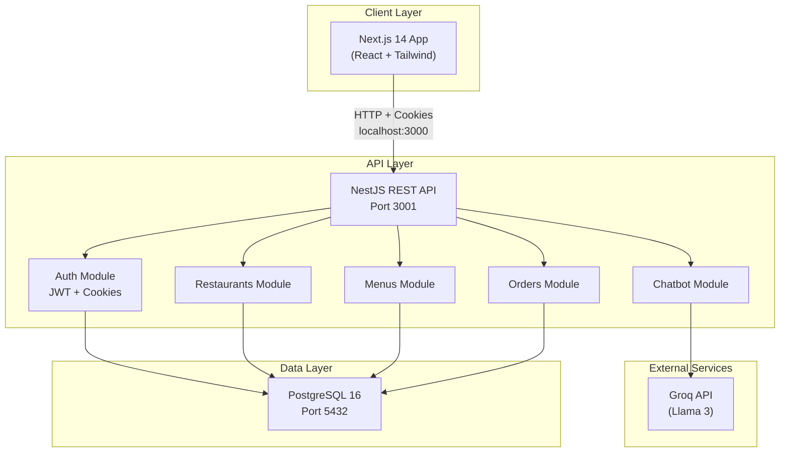
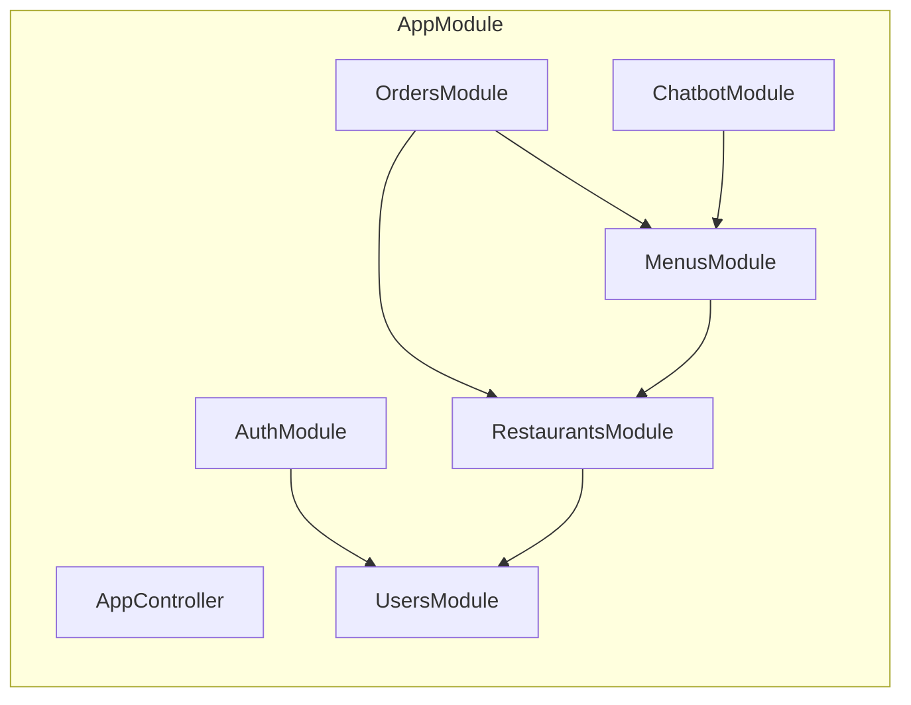
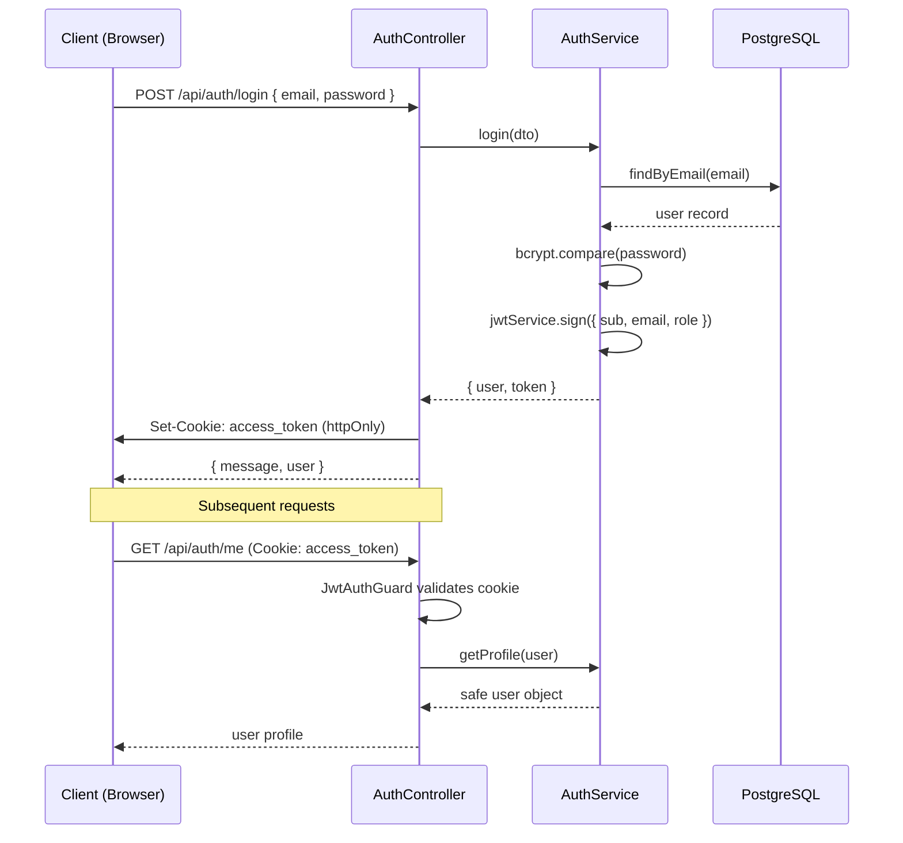
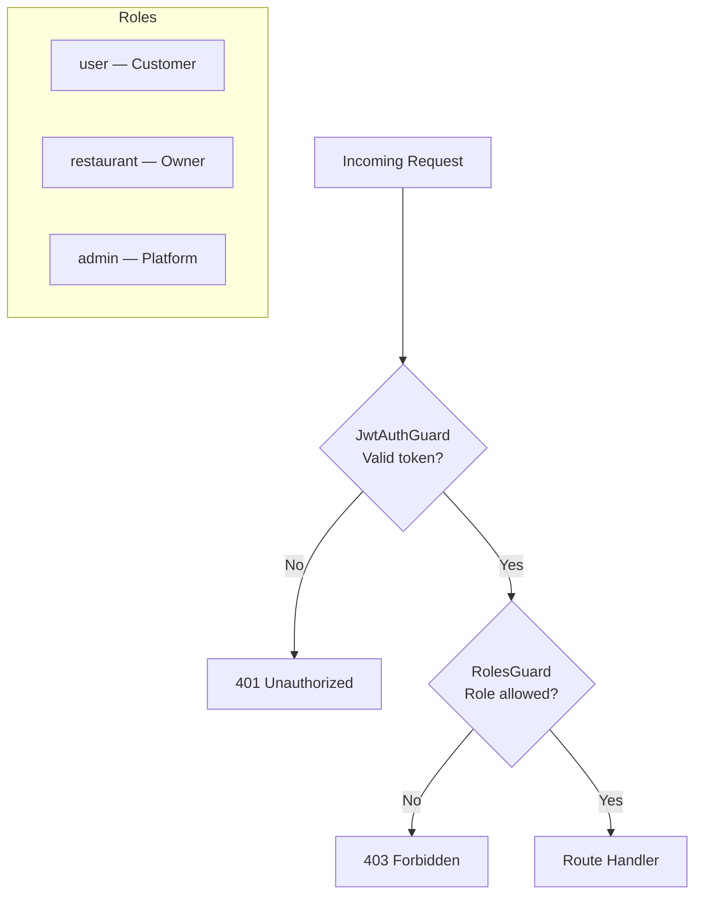
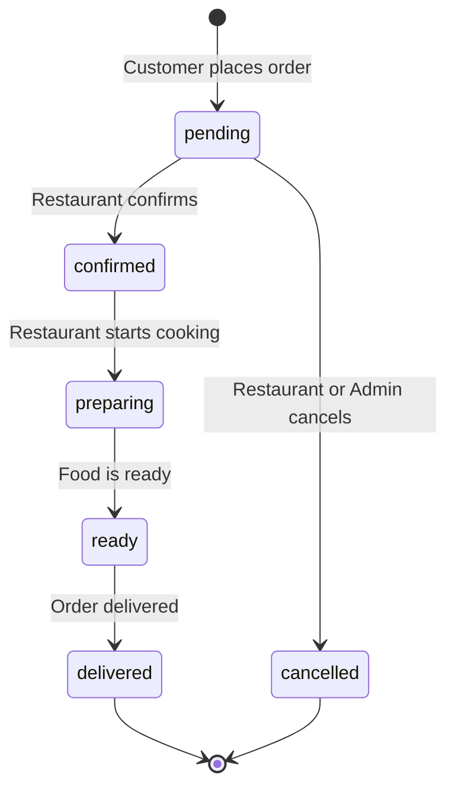
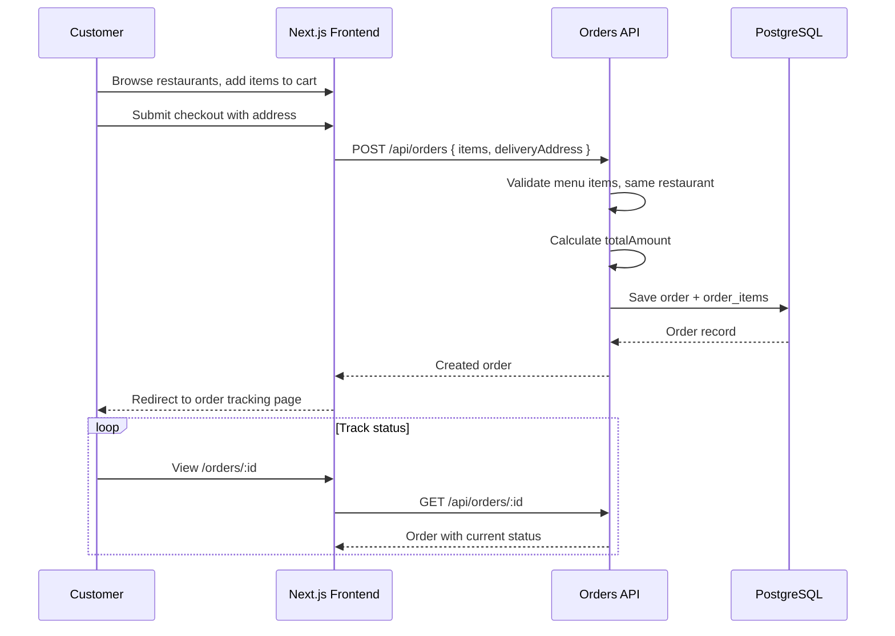
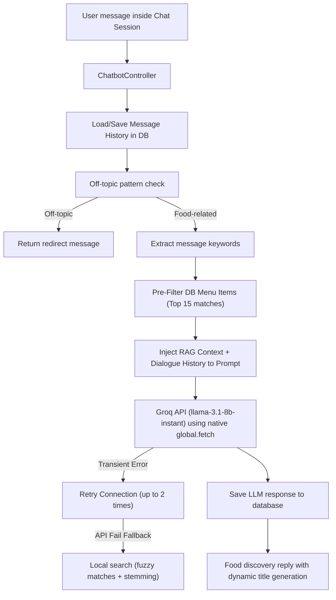
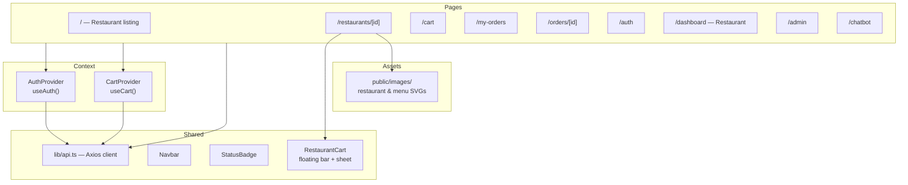
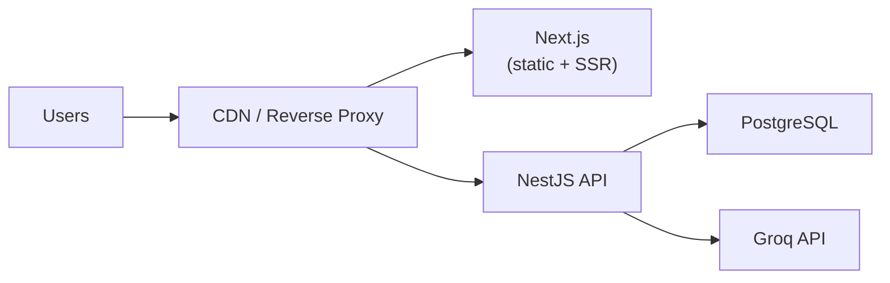

# FoodRush Architecture

FoodRush is a full-stack food ordering platform with three user roles (Customer, Restaurant, Admin) and an AI-powered food discovery chatbot. The system follows a classic three-tier architecture with clear separation between presentation, business logic, and data layers.

## High-Level Overview

## Technology Stack

| Layer | Technology | Purpose |
|-------|------------|---------|
| Frontend | Next.js 14, React 18, TypeScript | Server/client components, routing |
| Styling | Tailwind CSS | Responsive UI design |
| State | React Context | Auth state, cart state |
| HTTP Client | Axios | API calls with credentials |
| Backend | NestJS 10, TypeScript | Modular REST API |
| ORM | TypeORM | Entity mapping, migrations |
| Database | PostgreSQL 16 | Persistent data storage |
| Auth | JWT, Passport, bcryptjs | Secure authentication |
| AI | Groq SDK (Llama 3) | Food discovery chatbot |

## Backend Module Structure

Each NestJS module encapsulates:

- **Controller** — HTTP route handlers and request validation
- **Service** — Business logic and database operations
- **Entity** — TypeORM database models (where applicable)
- **DTO** — Data transfer objects with `class-validator` rules

## Authentication Flow

### Security Measures

- Passwords hashed with bcrypt (12 rounds) before storage
- JWT stored in HTTP-only cookies (not accessible via JavaScript)
- `sameSite: lax` prevents CSRF on cross-site requests
- Role-based guards (`RolesGuard`) enforce RBAC on protected endpoints
- Global `ValidationPipe` strips unknown fields and validates DTOs

## Authorization (RBAC)

| Role | Capabilities |
|------|--------------|
| `user` | Browse, order, track orders, use chatbot |
| `restaurant` | Manage menu, view/update restaurant orders |
| `admin` | View all orders, cancel any pending order |

## Order Lifecycle

Restaurant owners can advance orders through the workflow. Admins can only cancel orders (set status to `cancelled`).

## Customer Order Flow

## Chatbot Architecture

The chatbot is structured as a Persistent Retrieval-Augmented Generation (RAG) assistant named **Foodie Chef Assistant**, scoped strictly to food discovery and culinary suggestions.

### Core Architecture Enhancements
1. **Persistent Database History**: Conversations (`ChatConversation` entity) and messages (`ChatMessageEntity`) are persisted in PostgreSQL.
2. **Context Pre-Filtering (RAG)**: Extracts search terms from queries and scores all menu items based on name/description matches, injecting only the top 15 most relevant candidates into the LLM context to optimize token limits.
3. **Fuzzy Local Fallback**: If the API key is unconfigured or rate-limited, the system falls back to a local keyword search using a Levenshtein-distance typo-tolerance calculator and suffix-reduction word stemmer.
4. **Transient Network Resiliency**: Connects to Groq using Node's native `global.fetch` to prevent legacy `node-fetch` decompressor socket drops, and retries failed calls up to 2 times automatically.
5. **Intelligent Title Summarization**: When starting a new session, dispatches a request to the LLM to generate a clean 2–4 word title (e.g. *"Spicy Burger Craving"*) based on the user's first query.

## Frontend Architecture

### Role-Based Routing

- Unauthenticated users can browse restaurants and menus
- Login required for cart, orders, and chatbot
- `/dashboard` restricted to `restaurant` role
- `/admin` restricted to `admin` role
- Navbar links adapt based on current user role

### Cart UX (Restaurant Page)

- Desktop: sticky order sidebar appears only when the cart has items for the current restaurant
- Mobile: compact floating bar opens a bottom sheet for cart review before checkout
- Add-to-cart shows a brief toast confirmation

### Static Images

Restaurant and menu `imageUrl` values point to SVG assets in `frontend/public/images/`, generated via `npm run generate:images` and seeded by `npm run seed`.

## Deployment Topology (Production)

See [deployment-guide.md](./deployment-guide.md) for environment-specific setup instructions.

## Key Design Decisions

1. **HTTP-only cookies for JWT** — Reduces XSS token theft risk compared to localStorage
2. **Single-restaurant orders** — Cart enforces items from one restaurant per order
3. **Snapshot pricing** — Order items store `unitPrice` and `menuItemName` at order time
4. **Synchronize in development** — Schema auto-sync for fast iteration; migrations for production
5. **Chatbot context injection** — Menu data passed to Groq ensures grounded recommendations

## Related Documentation

- [Database Design](./database-design.md)
- [API Specification](./api-specification.md)
- [Testing Checklist](./testing-checklist.md)
- [Deployment Guide](./deployment-guide.md)
- [Requirements](./requirements.md)
