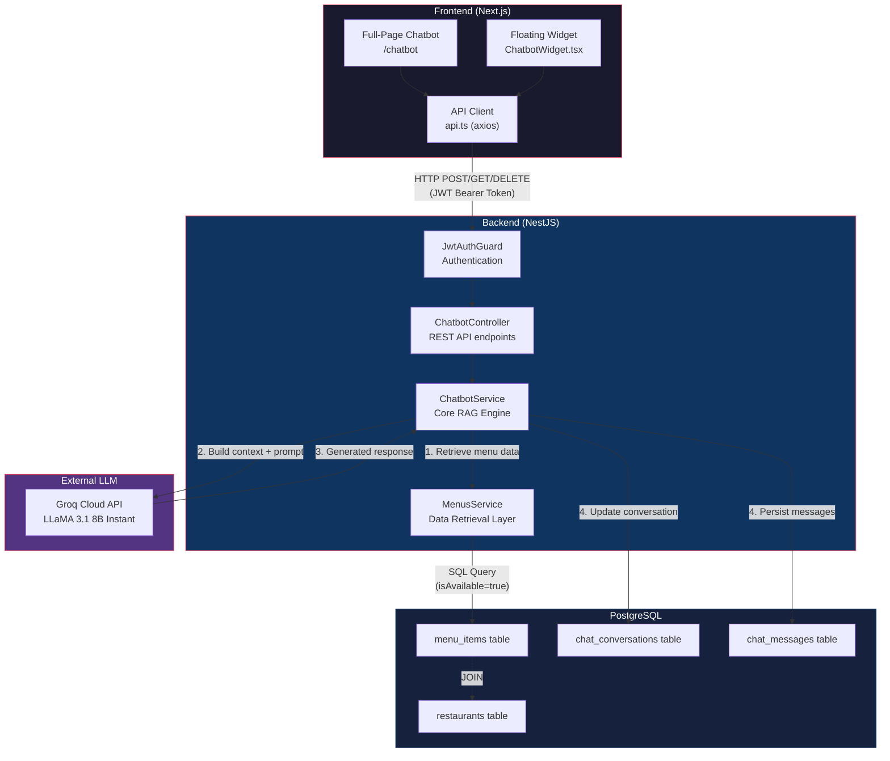
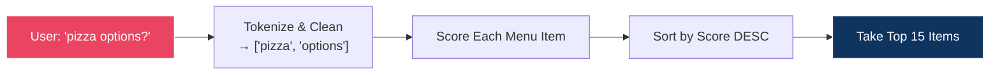
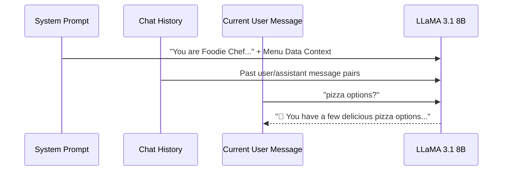
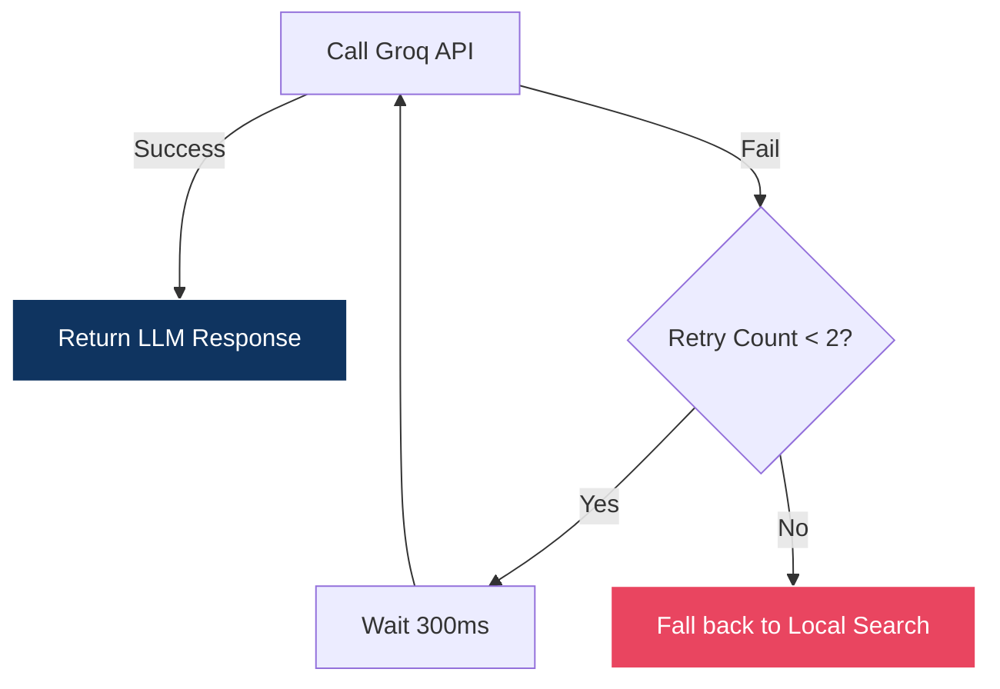
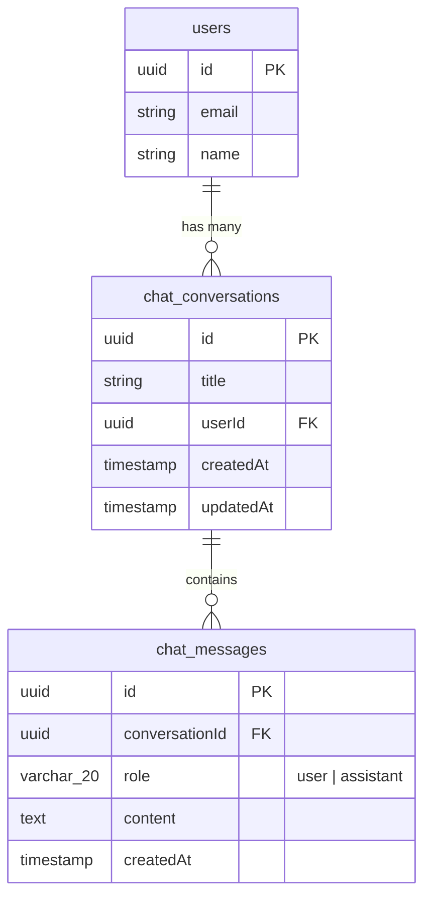
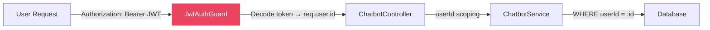
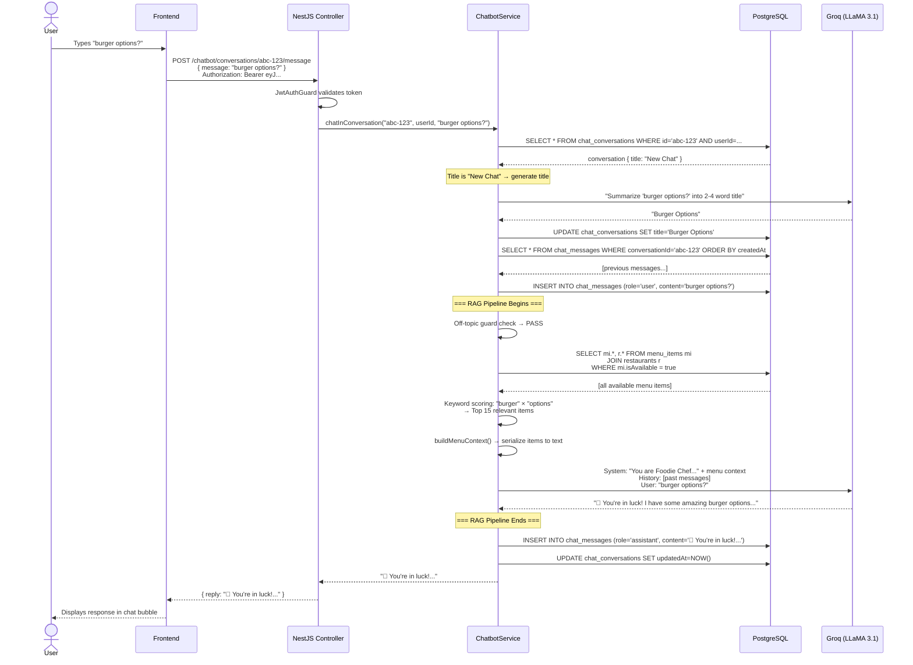

# FoodRush AI Chatbot — Deep Architectural Analysis

## 1. High-Level Overview

The FoodRush chatbot is a **domain-restricted AI food discovery assistant** powered by a **Retrieval-Augmented Generation (RAG)** pipeline. It combines real-time database retrieval of restaurant menus with LLM-based natural language generation to help users discover dishes, get recommendations, and explore restaurants.

> [!IMPORTANT]
> This is **not** a general-purpose chatbot. It is architecturally constrained to only discuss food, dishes, and restaurants using data from your own PostgreSQL database as its knowledge source.

---

## 2. System Architecture Diagram



---

## 3. The RAG Pipeline — Step by Step

RAG (Retrieval-Augmented Generation) is the technique that makes this chatbot **aware of your actual restaurant data** rather than hallucinating menu items. Here's exactly how each message flows through the system:

### Step 1: User Sends a Message

The frontend sends a `POST` request to one of two endpoints:

| Endpoint | Purpose | Auth |
|---|---|---|
| `POST /chatbot/message` | Stateless single-shot chat (legacy) | JWT |
| `POST /chatbot/conversations/:id/message` | Persistent conversation chat | JWT |

The controller ([chatbot.controller.ts](file:///c:/Users/nouman.hafeez/Desktop/FoodRush/backend/src/chatbot/chatbot.controller.ts)) validates the JWT, extracts `req.user.id`, and delegates to the service.

---

### Step 2: Off-Topic Guard (Intent Filtering)

Before any data retrieval, the service runs a **regex-based intent classifier** ([chatbot.service.ts L47-55](file:///c:/Users/nouman.hafeez/Desktop/FoodRush/backend/src/chatbot/chatbot.service.ts#L47-L55)):

```typescript
const offTopicPatterns = [
  /complain/i, /complaint/i, /refund/i, /payment/i, /pay/i,
  /cancel.*order/i, /track.*order/i, /order.*status/i,
  /weather/i, /news/i, /joke/i, /sports/i,
];
```

If any pattern matches, the chatbot **immediately returns a rejection** without wasting an LLM API call. This acts as a first-line guardrail that keeps the bot domain-focused and saves API costs.

---

### Step 3: **R** in RAG — Retrieval (Database Query)

This is the critical step that makes the chatbot "aware" of your data. The service calls:

```typescript
const menuItems = await this.menusService.findAllForChatbot();
```

This method ([menus.service.ts L64-70](file:///c:/Users/nouman.hafeez/Desktop/FoodRush/backend/src/menus/menus.service.ts#L64-L70)) executes:

```sql
SELECT mi.*, r.*
FROM menu_items mi
LEFT JOIN restaurants r ON mi."restaurantId" = r.id
WHERE mi."isAvailable" = true
ORDER BY mi.name ASC
```

It pulls **every available menu item** with its parent restaurant data (name, cuisine, rating, address). This is the **knowledge base** — the chatbot can only ever recommend items that exist in this result set.

#### Data Shape Retrieved

For each item, the chatbot has access to:

| Field | Source Table | Example |
|---|---|---|
| `name` | `menu_items` | "Margherita Pizza" |
| `description` | `menu_items` | "San Marzano tomato, fresh mozzarella, basil" |
| `category` | `menu_items` | "Pizza" |
| `price` | `menu_items` | 1200.00 |
| `isAvailable` | `menu_items` | true |
| `restaurant.name` | `restaurants` | "Napoli Kitchen" |
| `restaurant.cuisine` | `restaurants` | "Italian" |

---

### Step 4: Contextual Pre-Filtering (Keyword Scoring)

Rather than sending the **entire menu catalog** to the LLM (which would exceed token limits and dilute relevance), the service performs a **keyword-based relevance scoring** pass ([chatbot.service.ts L63-103](file:///c:/Users/nouman.hafeez/Desktop/FoodRush/backend/src/chatbot/chatbot.service.ts#L63-L103)):



#### Scoring Weights

| Match Location | Weight | Rationale |
|---|---|---|
| Item **name** contains term | **+3** | Strongest signal — user likely wants this exact item |
| Item **category** contains term | **+2** | Category match (e.g., "burger" → "Burgers" category) |
| Item **description** contains term | **+2** | Ingredient/flavor match |
| **Restaurant name** contains term | **+2** | User asking about a specific restaurant |
| Restaurant **cuisine** contains term | **+1** | Broad cuisine match |

The top **15 scored items** are kept. If no items score > 0, the first 15 items alphabetically are used as fallback context.

> [!TIP]
> This pre-filtering step is essentially a **lightweight retrieval engine** — it's the "R" in RAG. It ensures the LLM only sees the most relevant menu items, keeping the prompt focused and token-efficient.

---

### Step 5: **A** in RAG — Augmentation (Prompt Construction)

The filtered menu items are serialized into a structured text context via [buildMenuContext()](file:///c:/Users/nouman.hafeez/Desktop/FoodRush/backend/src/chatbot/chatbot.service.ts#L192-L199):

```
- Margherita Pizza (Pizza) at Napoli Kitchen: PKR 1200 — San Marzano tomato, fresh mozzarella, basil
- Classic Smash Burger (Burgers) at Burger Forge: PKR 950 — Double smashed patties, cheddar, pickles, secret sauce
- Crispy Chicken Burger (Burgers) at Burger Forge: PKR 850 — Buttermilk fried chicken, coleslaw, chipotle mayo
```

This context is then **injected into the system prompt** as grounding data:

```typescript
const systemPrompt = `You are "Foodie Chef", a warm, enthusiastic culinary guide...

Guidelines:
- Recommend ONLY dishes and restaurants from the current menu data below.
- NEVER discuss order cancellations, refunds, payments, complaints...
- If a dish is not in the data below, say you don't have it but suggest similar alternatives...

Current Available Menu Data:
${menuContext}`;
```

> [!IMPORTANT]
> **This is the core RAG technique**: the LLM's system prompt is dynamically augmented with real-time database data at every request. The model doesn't "know" your menu — it reads it fresh from the prompt each time. This means:
> - Menu changes in the database are **instantly reflected** in chatbot responses
> - The bot **cannot hallucinate items** that don't exist in your database
> - No retraining or fine-tuning is ever needed

---

### Step 6: **G** in RAG — Generation (LLM Inference)

The complete message payload is sent to **Groq Cloud** running **LLaMA 3.1 8B Instant** ([chatbot.service.ts L152-190](file:///c:/Users/nouman.hafeez/Desktop/FoodRush/backend/src/chatbot/chatbot.service.ts#L152-L190)):

```typescript
const completion = await this.groq.chat.completions.create({
  model: 'llama-3.1-8b-instant',
  messages: formattedMessages,
  max_tokens: 300,
  temperature: 0.3,
});
```

#### Message Array Structure



The messages array sent to the LLM is:

```json
[
  { "role": "system",    "content": "You are Foodie Chef... \n\nCurrent Available Menu Data:\n- Margherita Pizza..." },
  { "role": "user",      "content": "pizza options?" },        // from chat history
  { "role": "assistant", "content": "🍕 You have a few..." },  // from chat history
  { "role": "user",      "content": "burger options?" }        // current message
]
```

#### LLM Configuration Choices

| Parameter | Value | Why |
|---|---|---|
| **Model** | `llama-3.1-8b-instant` | Fast inference (~200ms), cost-effective, sufficient for food recommendations |
| **max_tokens** | `300` | Keeps responses concise; prevents long-winded paragraphs |
| **temperature** | `0.3` | Low creativity — we want factual, grounded answers, not creative writing |
| **Provider** | Groq Cloud | Groq's LPU hardware provides ~10x faster inference than GPU-based providers |

> [!NOTE]
> **Why LLaMA 3.1 8B and not GPT-4 or a larger model?**
> For a constrained task like food recommendations where the answer is always grounded in provided context, a smaller model is both faster and cheaper while being equally accurate. The "intelligence" comes from the RAG context, not the model size.

---

### Step 7: Retry & Fallback Mechanism

The service implements a **2-attempt retry with 300ms delay** ([chatbot.service.ts L131-150](file:///c:/Users/nouman.hafeez/Desktop/FoodRush/backend/src/chatbot/chatbot.service.ts#L131-L150)):



If the LLM is completely unavailable (no API key, network error, rate limit), the system **degrades gracefully** to the local search engine.

---

### Step 8: Local Food Search Fallback Engine

When the LLM is unavailable, the service uses a **multi-strategy text matching engine** ([chatbot.service.ts L235-338](file:///c:/Users/nouman.hafeez/Desktop/FoodRush/backend/src/chatbot/chatbot.service.ts#L235-L338)) that combines three NLP techniques:

#### Strategy 1: Exact / Substring Matching
Direct `string.includes()` checks with weighted scoring (same weights as Step 4).

#### Strategy 2: Stemmed Matching
A custom [stemWord()](file:///c:/Users/nouman.hafeez/Desktop/FoodRush/backend/src/chatbot/chatbot.service.ts#L221-L233) function normalizes plural/singular forms:

```
"pizzas"  → "pizza"    (remove trailing 's')
"berries" → "berry"    (replace 'ies' → 'y')
"dishes"  → "dish"     (remove 'es')
```

This lets "burgers" match "burger", "pizzas" match "pizza", etc.

#### Strategy 3: Fuzzy Matching (Levenshtein Distance)
A [levenshteinDistance()](file:///c:/Users/nouman.hafeez/Desktop/FoodRush/backend/src/chatbot/chatbot.service.ts#L201-L219) implementation handles **typos**:

```
"piza"  → "pizza"  (distance = 1 → match with 1.5 weight)
"brger" → "burger" (distance = 1 → match with 1.5 weight)
"chiken"→ "chicken"(distance = 2 → match with 0.75 weight)
```

> [!TIP]
> The local fallback means the chatbot **never completely breaks** — even without an API key or internet connection, users still get relevant food results via keyword + fuzzy matching. This is a production-resilient design.

---

## 4. Conversation Persistence Layer

### Database Schema



### Conversation Lifecycle

| Action | Endpoint | What Happens |
|---|---|---|
| Create | `POST /chatbot/conversations` | Creates row with `title = "New Chat"` |
| First message | `POST /chatbot/conversations/:id/message` | **Auto-generates title** via LLM |
| Subsequent messages | Same endpoint | Appends to history, uses history for context |
| List all | `GET /chatbot/conversations` | Returns all user's chats, sorted by `updatedAt DESC` |
| Load messages | `GET /chatbot/conversations/:id/messages` | Returns all messages in chronological order |
| Delete | `DELETE /chatbot/conversations/:id` | Cascading delete of conversation + all messages |

---

## 5. Auto Title Generation

When the first message is sent in a "New Chat" conversation, the service calls [generateConversationTitle()](file:///c:/Users/nouman.hafeez/Desktop/FoodRush/backend/src/chatbot/chatbot.service.ts#L435-L458):

```typescript
const completion = await this.groq.chat.completions.create({
  model: GROQ_MODEL,
  messages: [
    {
      role: 'system',
      content: 'You are a title generator. Summarize the user query into a clean, concise, 2-4 words title...',
    },
    { role: 'user', content: message },
  ],
  max_tokens: 15,
  temperature: 0.5,
});
```

> [!NOTE]
> **Your earlier observation about "pizza options?" generating "Pizza Topping Options"**: This is because the title generator is a **separate LLM call** with `temperature: 0.5` (moderate creativity). The LLM interprets "pizza options?" and summarizes it as "Pizza Topping Options" because it's trying to create a 2-4 word descriptive title, not echo the query verbatim. This is expected behavior — the title is a summary, not a copy.
>
> If the LLM is unavailable, it falls back to truncating the first 25 characters: `"pizza options?"` → `"pizza options?"`.

---

## 6. Security & Access Control



- Every endpoint is protected by `@UseGuards(JwtAuthGuard)`
- The `userId` is extracted from the JWT, **never from the request body**
- All conversation queries are **scoped to the authenticated user** — User A cannot read User B's chat history

---

## 7. Complete Request Lifecycle (End to End)



---

## 8. Tech Stack Summary

| Layer | Technology | Purpose |
|---|---|---|
| **LLM Provider** | Groq Cloud | Ultra-fast inference hosting |
| **LLM Model** | LLaMA 3.1 8B Instant | Open-source, fast, cost-effective for constrained tasks |
| **Backend Framework** | NestJS (TypeScript) | REST API, dependency injection, module architecture |
| **ORM** | TypeORM | PostgreSQL entity mapping, migrations |
| **Database** | PostgreSQL | Menu items, restaurants, conversations, messages |
| **Frontend** | Next.js 14 (React) | Full-page chat UI + floating widget |
| **HTTP Client** | Axios | Frontend-to-backend API communication |
| **Auth** | JWT (Bearer Token) | User identity + conversation scoping |
| **SDK** | groq-sdk (npm) | Official Groq API client for Node.js |

---

## 9. What This Is NOT

To set clear expectations about the current architecture:

| Technique | Status | Notes |
|---|---|---|
| **Vector embeddings** | ❌ Not used | No embedding model, no vector similarity search |
| **Vector database** (Pinecone, Weaviate, ChromaDB) | ❌ Not used | Menu data is small enough for full SQL retrieval |
| **Semantic search** | ❌ Not used | Uses keyword + fuzzy matching instead |
| **Fine-tuned model** | ❌ Not used | Uses a general-purpose LLaMA with prompt engineering |
| **Streaming responses** | ❌ Not used | Full response is returned in a single HTTP response |
| **Memory/context window management** | ⚠️ Basic | Full history is sent each time — no sliding window or summarization |

> [!NOTE]
> **Is this truly "RAG"?** — Yes, but it's a **lightweight/pragmatic RAG**. Traditional RAG uses vector embeddings + similarity search for retrieval. This implementation uses SQL + keyword scoring for retrieval, which works very well for a bounded dataset like restaurant menus (likely < 1,000 items). The "augmentation" and "generation" steps are textbook RAG — context injection into the system prompt.

---

## 10. Potential Improvements

| Improvement | Difficulty | Impact |
|---|---|---|
| Add streaming (`text/event-stream`) for real-time typing effect | Medium | Better UX |
| Implement sliding window for long conversations (summarize old messages) | Medium | Prevents token limit overflow |
| Add vector embeddings (e.g., `text-embedding-3-small`) for semantic retrieval | High | Better matching for vague queries like "something spicy" |
| Cache menu context with TTL (don't re-fetch on every message) | Low | Reduce database load |
| Add tool/function calling for "add to cart" actions from chat | High | Game-changing UX |
