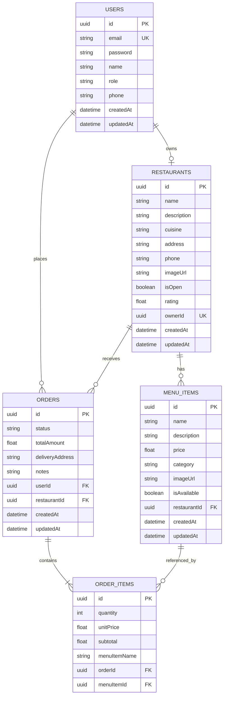
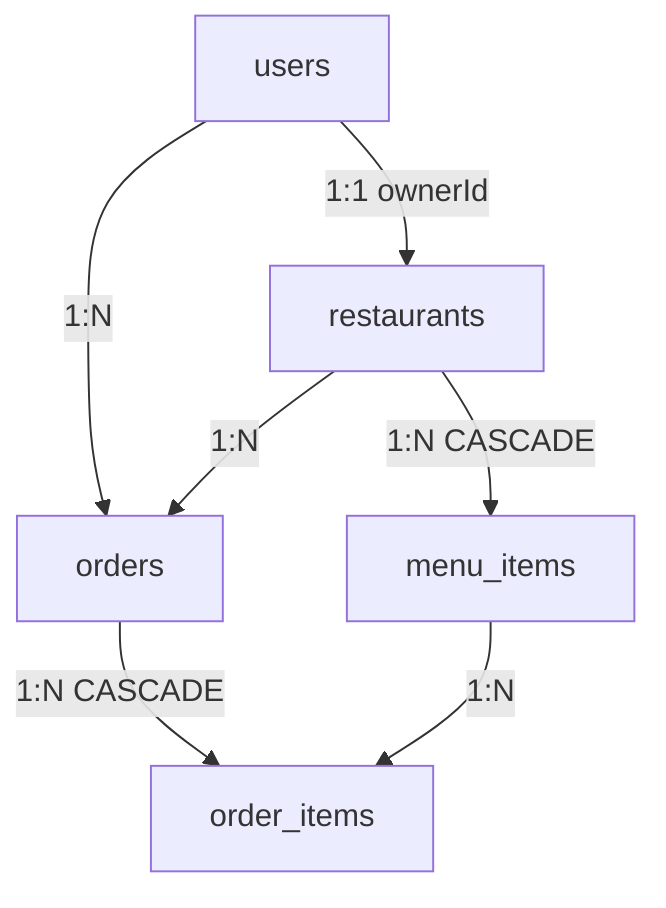

# FoodRush Database Design

PostgreSQL 16 is the primary data store. The schema supports users, restaurants, menus, orders, and order line items with role-based ownership and referential integrity.

## Entity Relationship Diagram



> **Note:** Mermaid `erDiagram` allows only one key per attribute (`PK`, `FK`, or `UK`). `ownerId` is both a foreign key and unique — shown as `UK` above; see the `restaurants` table for full constraints.

## Tables

### `users`

Stores all platform accounts (customers, restaurant owners, admins).

| Column | Type | Constraints | Description |
|--------|------|-------------|-------------|
| `id` | `uuid` | PK, default `gen_random_uuid()` | Unique user identifier |
| `email` | `varchar` | UNIQUE, NOT NULL | Login email |
| `password` | `varchar` | NOT NULL | bcrypt-hashed password |
| `name` | `varchar` | NOT NULL | Display name |
| `role` | `enum` | NOT NULL, default `user` | `user`, `restaurant`, or `admin` |
| `phone` | `varchar` | NULLABLE | Optional contact number |
| `createdAt` | `timestamp` | NOT NULL | Record creation time |
| `updatedAt` | `timestamp` | NOT NULL | Last update time |

**Indexes:** Unique on `email`.

**Relationships:**

- One user may own one restaurant (`restaurants.ownerId`)
- One user may place many orders (`orders.userId`)

### `restaurants`

Restaurant profiles linked to a restaurant-owner user.

| Column | Type | Constraints | Description |
|--------|------|-------------|-------------|
| `id` | `uuid` | PK | Restaurant identifier |
| `name` | `varchar` | NOT NULL | Restaurant name |
| `description` | `varchar` | NULLABLE | About text |
| `cuisine` | `varchar` | NULLABLE | Cuisine type (e.g. Pakistani) |
| `address` | `varchar` | NULLABLE | Physical address |
| `phone` | `varchar` | NULLABLE | Contact phone |
| `imageUrl` | `varchar` | NULLABLE | Cover image URL |
| `isOpen` | `boolean` | NOT NULL, default `true` | Open/closed flag |
| `rating` | `decimal(3,1)` | NULLABLE | Display rating (optional) |
| `ownerId` | `uuid` | FK → `users.id`, UNIQUE | Owning user |
| `createdAt` | `timestamp` | NOT NULL | Created at |
| `updatedAt` | `timestamp` | NOT NULL | Updated at |

**Constraints:** One restaurant per owner (`ownerId` is unique).

### `menu_items`

Dishes and items offered by a restaurant.

| Column | Type | Constraints | Description |
|--------|------|-------------|-------------|
| `id` | `uuid` | PK | Menu item identifier |
| `name` | `varchar` | NOT NULL | Item name |
| `description` | `varchar` | NULLABLE | Item description |
| `price` | `decimal(10,2)` | NOT NULL | Price in PKR |
| `category` | `varchar` | NULLABLE | Category (Rice, Curry, etc.) |
| `imageUrl` | `varchar` | NULLABLE | Item image URL |
| `isAvailable` | `boolean` | NOT NULL, default `true` | Availability flag |
| `restaurantId` | `uuid` | FK → `restaurants.id`, ON DELETE CASCADE | Parent restaurant |
| `createdAt` | `timestamp` | NOT NULL | Created at |
| `updatedAt` | `timestamp` | NOT NULL | Updated at |

**Cascade:** Deleting a restaurant removes its menu items.

### `orders`

Customer orders placed at a single restaurant.

| Column | Type | Constraints | Description |
|--------|------|-------------|-------------|
| `id` | `uuid` | PK | Order identifier |
| `status` | `enum` | NOT NULL, default `pending` | Order lifecycle status |
| `totalAmount` | `decimal(10,2)` | NOT NULL | Sum of line items |
| `deliveryAddress` | `varchar` | NULLABLE | Customer delivery address |
| `notes` | `varchar` | NULLABLE | Special instructions |
| `userId` | `uuid` | FK → `users.id` | Customer |
| `restaurantId` | `uuid` | FK → `restaurants.id` | Target restaurant |
| `createdAt` | `timestamp` | NOT NULL | Order placed at |
| `updatedAt` | `timestamp` | NOT NULL | Last status change |

**Status enum values:** `pending`, `confirmed`, `preparing`, `ready`, `delivered`, `cancelled`

### `order_items`

Line items within an order. Prices and names are snapshotted at order time.

| Column | Type | Constraints | Description |
|--------|------|-------------|-------------|
| `id` | `uuid` | PK | Line item identifier |
| `quantity` | `integer` | NOT NULL | Number of units |
| `unitPrice` | `decimal(10,2)` | NOT NULL | Price per unit at order time |
| `subtotal` | `decimal(10,2)` | NOT NULL | `quantity × unitPrice` |
| `menuItemName` | `varchar` | NOT NULL | Item name snapshot |
| `orderId` | `uuid` | FK → `orders.id`, ON DELETE CASCADE | Parent order |
| `menuItemId` | `uuid` | FK → `menu_items.id` | Reference to menu item |

## Referential Integrity



| Relationship | On Delete |
|--------------|-----------|
| `restaurants.ownerId → users.id` | NO ACTION |
| `menu_items.restaurantId → restaurants.id` | CASCADE |
| `orders.userId → users.id` | NO ACTION |
| `orders.restaurantId → restaurants.id` | NO ACTION |
| `order_items.orderId → orders.id` | CASCADE |
| `order_items.menuItemId → menu_items.id` | SET NULL |
| `chat_conversations.userId → users.id` | CASCADE |
| `chat_messages.conversationId → chat_conversations.id` | CASCADE |

## TypeORM Entities

Entity files map directly to tables:

| Entity | File | Description |
|--------|------|-------------|
| `User` | `backend/src/users/user.entity.ts` | Profiles for Customer, Restaurant, and Admin users |
| `Restaurant` | `backend/src/restaurants/restaurant.entity.ts` | Restaurant metadata and merchant controls |
| `MenuItem` | `backend/src/restaurants/menu-item.entity.ts` | Menu item selections (dishes/prices) |
| `Order` | `backend/src/orders/order.entity.ts` | Historical records of orders |
| `OrderItem` | `backend/src/orders/order-item.entity.ts` | Single order item details linked to orders |
| `ChatConversation` | `backend/src/chatbot/chat-conversation.entity.ts` | Persistent chat thread descriptors |
| `ChatMessageEntity` | `backend/src/chatbot/chat-message.entity.ts` | Historical logs of conversation dialogues |

## Migrations

Initial schema migration: `backend/src/migrations/1730000000000-InitialSchema.ts`

```bash
# Run migrations (production)
cd backend
npm run migration:run
```

In development (`NODE_ENV=development`), TypeORM `synchronize: true` auto-creates schema from entities.

## Seed Data

The seed script (`npm run seed`) is idempotent — it creates missing records and updates image URLs on existing ones.

**Demo accounts** (all restaurant owners use password `rest123`):

| Role | Email | Password |
|------|-------|----------|
| Admin | `admin@foodrush.com` | `admin123` |
| Restaurant | `restaurant@foodrush.com` | `rest123` |
| Restaurant | `wok@foodrush.com` | `rest123` |
| Restaurant | `napoli@foodrush.com` | `rest123` |
| Restaurant | `burger@foodrush.com` | `rest123` |
| Restaurant | `spice@foodrush.com` | `rest123` |
| Restaurant | `taco@foodrush.com` | `rest123` |
| Customer | `customer@foodrush.com` | `cust123` |
| Customer | `sara@foodrush.com` | `cust123` |
| Customer | `hassan@foodrush.com` | `cust123` |
| Customer | `fatima@foodrush.com` | `cust123` |

**Restaurants seeded** (6 total, 33 menu items):

| Restaurant | Cuisine | Image path |
|------------|---------|------------|
| Biryani House | Pakistani | `/images/restaurants/biryani-house.svg` |
| Dragon Wok | Chinese | `/images/restaurants/dragon-wok.svg` |
| Napoli Kitchen | Italian | `/images/restaurants/napoli-kitchen.svg` |
| Burger Forge | Fast Food | `/images/restaurants/burger-forge.svg` |
| Spice Route | Indian | `/images/restaurants/spice-route.svg` |
| Taco Fiesta | Mexican | `/images/restaurants/taco-fiesta.svg` |

Seed data definitions: `backend/src/seed-data.ts`. Menu images use `/images/menus/<slug>.svg` paths served from the Next.js `public/` folder.

Regenerate SVG assets:

```bash
cd frontend
npm run generate:images
```

## Query Patterns

| Use Case | Query approach |
|----------|----------------|
| List restaurants | `SELECT * FROM restaurants ORDER BY name` |
| Menu by restaurant | `WHERE restaurantId = $1 ORDER BY category, name` |
| Customer orders | `WHERE userId = $1` with relations `restaurant`, `items` |
| Restaurant orders | `WHERE restaurantId = $1` with relations `user`, `items` |
| Chatbot menu search | `WHERE isAvailable = true` with relation `restaurant` |
| Admin all orders | Full list with `user`, `restaurant`, `items` |

## Design Notes

1. **Price snapshots** — `order_items.unitPrice` and `menuItemName` preserve historical order data if menu prices change later.
2. **Single-restaurant orders** — Enforced in application logic, not DB constraint.
3. **UUID primary keys** — Avoid sequential ID enumeration and simplify distributed IDs.
4. **Enum columns** — PostgreSQL native enums for `role` and `status` with TypeORM enum mapping.
