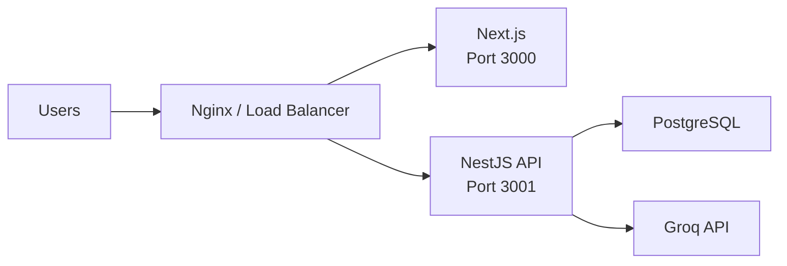

# FoodRush Deployment Guide

This guide covers local development setup, Docker database deployment, and production deployment considerations.

## Prerequisites

| Tool | Version |
|------|---------|
| Node.js | 18+ |
| npm | 9+ |
| Docker | 20+ |
| Docker Compose | 2+ |
| Git | Any recent version |

Optional: Groq API key for chatbot functionality ([console.groq.com](https://console.groq.com)).

## Local Development

### 1. Clone and Install

```bash
git clone <repository-url>
cd FoodRush
```

### 2. Start PostgreSQL with Docker Compose

```bash
docker compose up -d
```

Verify the database is healthy:

```bash
docker compose ps
```

Default connection settings (match `backend/.env.example`):

| Variable | Value |
|----------|-------|
| `DB_HOST` | `localhost` |
| `DB_PORT` | `5432` |
| `DB_USERNAME` | `postgres` |
| `DB_PASSWORD` | `password` |
| `DB_NAME` | `food_ordering_db` |

### 3. Configure Backend

```bash
cd backend
cp .env.example .env
```

Edit `backend/.env`:

```env
PORT=3001
NODE_ENV=development
FRONTEND_URL=http://localhost:3000

DB_HOST=localhost
DB_PORT=5432
DB_USERNAME=postgres
DB_PASSWORD=password
DB_NAME=food_ordering_db

JWT_SECRET=your_secure_random_secret_here
JWT_EXPIRATION=7d

GROQ_API_KEY=your_groq_api_key_here
# Optional. Without a key, chatbot uses local menu search. Model when set: llama-3.1-8b-instant
```

Install dependencies and start:

```bash
npm install
npm run start:dev
```

In development, TypeORM auto-synchronizes the schema from entities.

### 4. Seed Demo Data

```bash
npm run seed
```

Creates admin, restaurant owners, customers, six restaurants with menus, and local SVG `imageUrl` values. Re-running the seed updates images on existing records without duplicating data.

### 5. Configure Frontend

```bash
cd ../frontend
cp .env.example .env.local
```

```env
NEXT_PUBLIC_API_URL=/api
BACKEND_URL=http://localhost:3001
```

`NEXT_PUBLIC_API_URL=/api` routes browser requests through the Next.js dev proxy to the backend (avoids CORS and cookie issues). `BACKEND_URL` is the proxy target used by `next.config.mjs`.

Install and start:

```bash
npm install
npm run dev
```

Open [http://localhost:3000](http://localhost:3000).

**Useful frontend scripts:**

```bash
npm run dev:clean        # Clear .next cache and start dev (fixes chunk/cache errors)
npm run generate:images  # Regenerate restaurant and menu SVG assets
```

## Docker Compose Reference

```yaml
services:
  postgres:
    image: postgres:16-alpine
    ports:
      - "5432:5432"
    environment:
      POSTGRES_USER: postgres
      POSTGRES_PASSWORD: password
      POSTGRES_DB: food_ordering_db
    volumes:
      - postgres_data:/var/lib/postgresql/data
```

**Stop database:**

```bash
docker compose down
```

**Stop and remove data:**

```bash
docker compose down -v
```

## Production Deployment

### Architecture



### Backend Production Build

```bash
cd backend
npm install
npm run build
```

Set production environment:

```env
NODE_ENV=production
PORT=3001
FRONTEND_URL=https://your-frontend-domain.com

DB_HOST=your-db-host
DB_PORT=5432
DB_USERNAME=postgres
DB_PASSWORD=strong_production_password
DB_NAME=food_ordering_db

JWT_SECRET=long_random_secret_min_32_chars
JWT_EXPIRATION=7d

GROQ_API_KEY=your_groq_api_key
```

Run migrations before starting:

```bash
npm run migration:run
npm run start:prod
```

In production (`NODE_ENV=production`):

- `synchronize` is disabled
- Migrations run automatically on startup (`migrationsRun: true`)

### Frontend Production Build

```bash
cd frontend
npm install
npm run build
npm run start
```

Set `NEXT_PUBLIC_API_URL` to your production API URL (e.g. `https://api.foodrush.com/api`).

### Environment Variables Summary

#### Backend

| Variable | Required | Description |
|----------|----------|-------------|
| `PORT` | No | API port (default: 3001) |
| `NODE_ENV` | Yes | `development` or `production` |
| `FRONTEND_URL` | Yes | CORS origin for frontend |
| `DB_HOST` | Yes | PostgreSQL host |
| `DB_PORT` | No | PostgreSQL port (default: 5432) |
| `DB_USERNAME` | Yes | Database user |
| `DB_PASSWORD` | Yes | Database password |
| `DB_NAME` | Yes | Database name |
| `JWT_SECRET` | Yes | JWT signing secret |
| `JWT_EXPIRATION` | No | Token expiry (default: 7d) |
| `GROQ_API_KEY` | No* | Groq API key; omit for local-search-only chatbot |

\* Required for chatbot; other features work without it.

#### Frontend

| Variable | Required | Description |
|----------|----------|-------------|
| `NEXT_PUBLIC_API_URL` | Yes | API base URL (`/api` with Next.js proxy, or full URL in production) |
| `BACKEND_URL` | No | Proxy target for `/api` rewrites (default: `http://localhost:3001`) |

### PostgreSQL in Production

Options:

1. **Managed database** — AWS RDS, DigitalOcean Managed DB, Supabase, etc.
2. **Docker on VPS** — Extend `docker-compose.yml` with production settings
3. **Self-hosted** — Install PostgreSQL 16 on your server

Production recommendations:

- Use strong passwords and restrict network access
- Enable SSL connections
- Configure regular backups
- Do not expose PostgreSQL port publicly

### Reverse Proxy (Nginx Example)

```nginx
server {
    listen 80;
    server_name api.foodrush.com;

    location / {
        proxy_pass http://localhost:3001;
        proxy_http_version 1.1;
        proxy_set_header Host $host;
        proxy_set_header X-Real-IP $remote_addr;
        proxy_set_header X-Forwarded-For $proxy_add_x_forwarded_for;
        proxy_set_header X-Forwarded-Proto $scheme;
    }
}

server {
    listen 80;
    server_name foodrush.com;

    location / {
        proxy_pass http://localhost:3000;
        proxy_http_version 1.1;
        proxy_set_header Host $host;
        proxy_set_header Upgrade $http_upgrade;
        proxy_set_header Connection 'upgrade';
    }
}
```

Use HTTPS (Let's Encrypt / Certbot) in production.

### Cookie Security in Production

The backend sets cookies with:

- `httpOnly: true`
- `secure: true` when `NODE_ENV=production`
- `sameSite: lax`

Ensure frontend and backend share a parent domain or configure CORS/cookies appropriately for cross-subdomain setups.

### Process Management

Use PM2, systemd, or container orchestration to keep services running:

```bash
# PM2 example
pm2 start dist/main.js --name foodrush-api
pm2 start npm --name foodrush-web -- start
```

### Health Checks

| Service | Endpoint |
|---------|----------|
| API | `GET http://localhost:3001/api` |
| API (data) | `GET http://localhost:3001/api/restaurants` |
| Frontend | `GET http://localhost:3000` |
| Database | `docker compose exec postgres pg_isready` |

## Troubleshooting

| Issue | Solution |
|-------|----------|
| `ECONNREFUSED` on DB | Ensure `docker compose up -d` and wait for healthcheck |
| CORS errors | Verify `FRONTEND_URL` matches frontend origin exactly |
| 401 on all requests | Check cookie is sent (`withCredentials: true` in Axios) |
| Chatbot errors | Verify `GROQ_API_KEY` is set and valid |
| Migration failures | Ensure DB is empty or run `migration:run` on clean DB |
| Port in use | Change `PORT` in backend `.env` or stop conflicting process |
| Cannot connect / Network Error on login | Ensure backend is running (`npm run start:dev` in `backend/`); frontend proxies `/api` to `BACKEND_URL` |
| Next.js chunk/cache errors | Run `npm run dev:clean` in `frontend/`; use only one dev server |
| `Cannot GET /api` in browser | `GET /api` on port 3000 is proxied to the backend; direct backend URL is port **3001** |

## Related Documentation

- [Architecture](./architecture.md)
- [Database Design](./database-design.md)
- [API Specification](./api-specification.md)
- [Testing Checklist](./testing-checklist.md)
